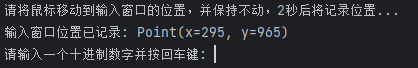

- [图灵完备二进制游戏成就完成脚本](#图灵完备二进制游戏成就完成脚本)
- [1. 如何使用](#1-如何使用)
  - [1.1 环境要求](#11-环境要求)
- [2. 使用方法](#2-使用方法)
  - [2.1 初始化](#21-初始化)
  - [2.2 开始游戏](#22-开始游戏)
- [3. 结束](#3-结束)

# 图灵完备二进制游戏成就完成脚本
 中文版 |[English](README_en.md)
# 1. 如何使用
## 1.1 环境要求
需要Python环境，并且有能正常运行  
需要安装pyautogui库，可以使用pip安装
```shell
pip install pyautogui
```
- [ ] 开发exe版本

# 2. 使用方法
## 2.1 初始化
首先需要将游戏窗口调整到合适大小，然后运行 **init.py**  
注意开发环境（比如pycharm）也在窗口化状态  

**保持上述两个窗口同时在屏幕上并且不要改变他们的位置**  

运行后根据提示提示窗口记录8个二进制按键位置与提交按键的位置  
最后文件将会保存在当前目录下的[position.txt](positions.txt)文件中
## 2.2 开始游戏
请先运行 **main.py**  
需要注意的是开始的时候需要停留2s记录输入窗口的位置（有输出区域的提示）  
程序运行并显示如下图所示状态时，可以开始游戏  
  
开始有游戏后输入对应的10进制数字即可自动完成点击，等级7即可通关拿到成就
# 3. 结束
```
祝玩的开心
```