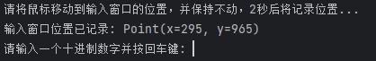

- [Turing-complete Binary Game Achievement Completion Script](#turing-complete-binary-game-achievement-completion-script)
- [1. How to Use](#1-how-to-use)
  - [1.1 Environment Requirements](#11-environment-requirements)
- [2. Usage Instructions](#2-usage-instructions)
  - [2.1 Initialization](#21-initialization)
  - [2.2 Start the Game](#22-start-the-game)
- [3. End](#3-end)

# Turing-complete Binary Game Achievement Completion Script
[中文版](README.md) | English- 
# 1. How to Use
## 1.1 Environment Requirements
You need a Python environment, and it must be functioning properly.  
The `pyautogui` library needs to be installed, which can be done using pip:
```shell
pip install pyautogui
```
- [ ] Develop an exe version

# 2. Usage Instructions
## 2.1 Initialization
First, adjust the game window to a suitable size, and then run **init.py**.  
Make sure that the development environment (such as PyCharm) is also windowed.  

**Keep both windows on the screen at the same time and do not move them.**  

After running, follow the instructions in the prompt to record the positions of the 8 binary buttons and the submit button.  
Finally, the positions will be saved in the [positions.txt](positions.txt) file in the current directory.

## 2.2 Start the Game
First, run **main.py**.  
Note that at the start, the program will pause for 2 seconds to record the position of the input window (with a prompt in the output area).  
Once the program is running and displays the state as shown in the image below, you can start playing the game.  
  
After the game starts, input the corresponding decimal numbers, and the script will automatically complete the clicks. The achievement can be completed at level 7.

# 3. End
```
Have fun playing!
```